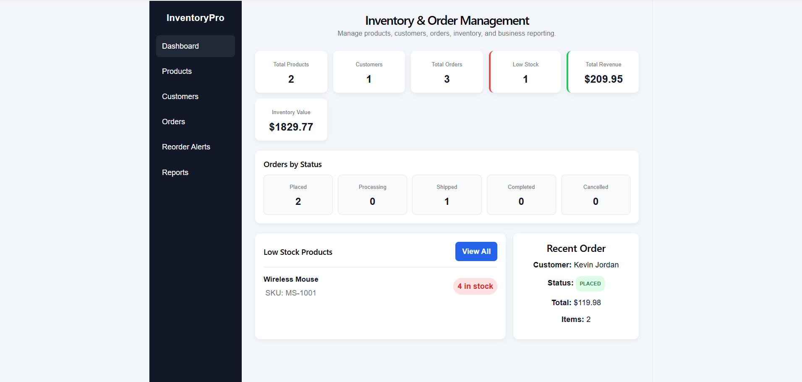
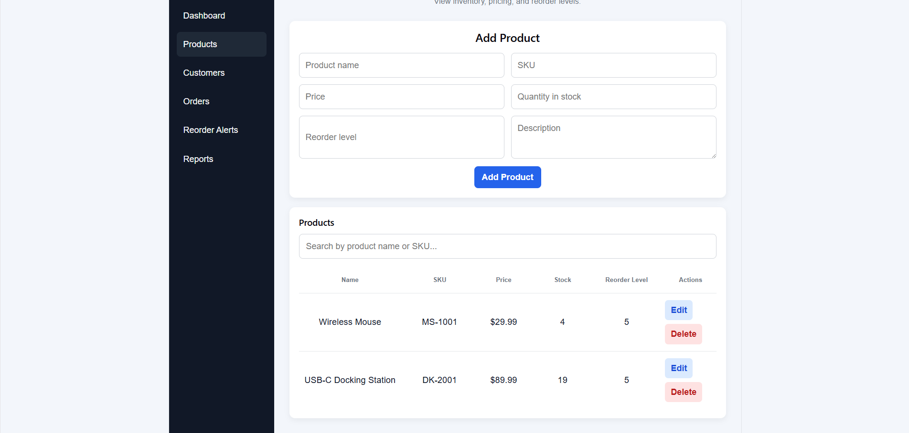
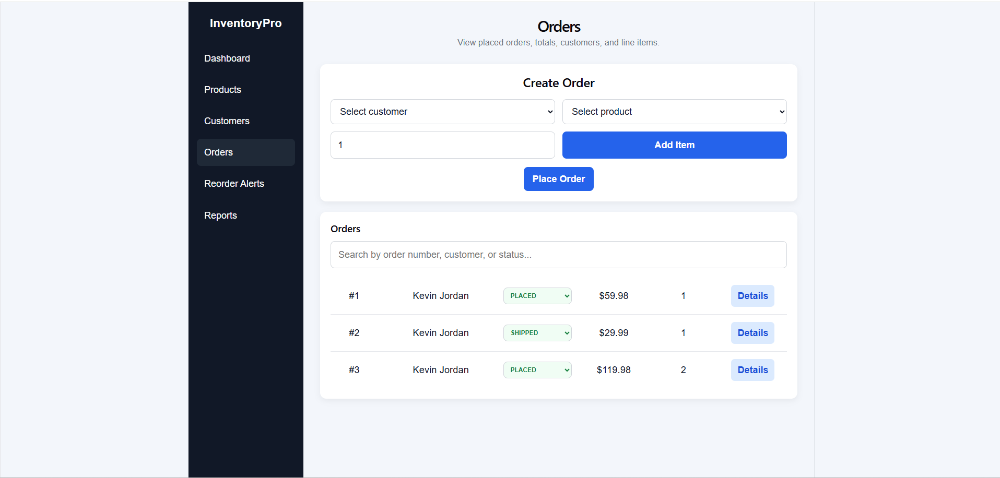
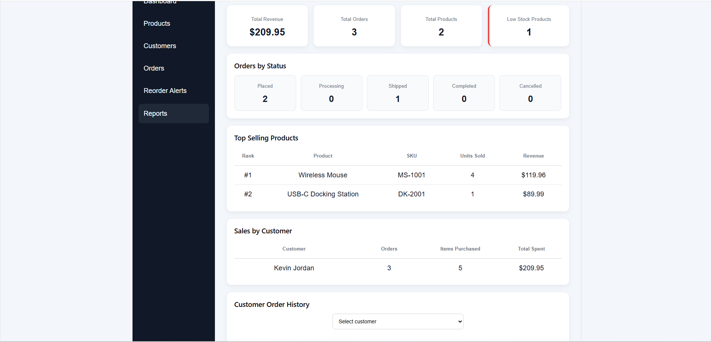

# InventoryPro

InventoryPro is a full-stack Inventory & Order Management System built with **Java, Spring Boot, React, TypeScript, PostgreSQL, and JWT authentication**.

The application provides businesses with a centralized system for managing products, customers, orders, inventory levels, and sales reporting through a responsive web dashboard.

## Features

### Authentication & Security

- User registration and login
- JWT-based authentication
- BCrypt password hashing
- Protected backend API endpoints
- Authorization headers for authenticated requests
- Spring Security configuration
- CORS configuration for frontend/backend communication

### Inventory Management

- Add, edit, and delete products
- Product search and filtering
- Track inventory quantities
- Track product pricing
- Configure reorder levels
- Automatic inventory reduction when orders are placed
- Low-stock and reorder alerts
- Inventory value calculations

### Customer Management

- Add, edit, and delete customers
- Store customer contact information
- Track customer orders
- View customer purchase history
- Calculate sales totals by customer

### Order Management

- Create customer orders
- Add products and quantities to orders
- Multi-item order support
- Automatic order total calculations
- Line-item price calculations
- Order status management
- Order detail views
- Automatic inventory updates after orders are placed
- Search orders by customer, order number, or status

### Reporting & Analytics

- Total revenue
- Total orders
- Total products
- Low-stock product count
- Inventory value
- Orders grouped by status
- Top-selling products
- Units sold by product
- Revenue by product
- Sales by customer
- Customer order history

## Tech Stack

### Backend

- Java 21
- Spring Boot
- Spring Security
- Spring Data JPA
- Hibernate
- JWT
- BCrypt
- PostgreSQL
- Maven
- REST APIs

### Frontend

- React
- TypeScript
- Vite
- CSS
- Fetch API

### Database

- PostgreSQL
- Spring Data JPA repositories
- Derived repository queries
- Custom JPQL queries
- Aggregate queries
- Relational entity relationships

### Deployment

- Render
- Neon PostgreSQL
- GitHub

## Database Query Features

InventoryPro demonstrates database querying beyond basic CRUD operations.

The application uses Spring Data JPA, derived repository methods, and custom JPQL queries for reporting and analytics.

Database operations include:

- Finding orders by customer
- Filtering orders by status
- Calculating total revenue
- Calculating top-selling products
- Aggregating units sold
- Calculating revenue by product
- Calculating sales by customer
- Counting customer orders
- Calculating total items purchased
- Identifying low-stock products
- Grouping and sorting sales data

Query techniques demonstrated include:

```text
SUM
COUNT
JOIN
GROUP BY
ORDER BY
```

## Authentication

InventoryPro uses JWT-based authentication to protect application data and backend API endpoints.

When a user successfully logs in, the backend generates a JWT token.

The frontend stores the token and includes it with authenticated API requests:

```text
Authorization: Bearer <JWT_TOKEN>
```

Passwords are hashed using BCrypt before being stored in the database.

## Architecture

InventoryPro follows a layered full-stack architecture:

```text
React + TypeScript Frontend
            ↓
         REST API
            ↓
      Spring Security
            ↓
   Spring Boot Controllers
            ↓
         Services
            ↓
 Spring Data JPA Repositories
            ↓
        PostgreSQL
```

## Project Structure

```text
inventory-order-management
│
├── inventory
│   └── Spring Boot backend
│
├── frontend
│   └── React + TypeScript frontend
│
├── screenshots
│   ├── dashboard.png
│   ├── products.png
│   ├── orders.png
│   └── reports.png
│
└── README.md
```

## Screenshots

### Dashboard



### Product Management



### Order Management



### Reports & Database Queries



## Production Deployment

InventoryPro is deployed as a full-stack production application.

The production environment uses:

- **Render** for application hosting
- **Neon PostgreSQL** for the production database
- **GitHub** for source control and deployment integration

## Skills Demonstrated

InventoryPro demonstrates practical experience with:

- Java development
- Object-oriented programming
- Spring Boot
- Spring Security
- JWT authentication
- REST API development
- PostgreSQL
- Relational database design
- SQL concepts
- Spring Data JPA
- Hibernate
- JPQL database queries
- Database aggregation and reporting
- React
- TypeScript
- Frontend/backend integration
- Authentication and authorization
- Inventory management business logic
- Order management business logic
- Reporting and analytics
- Responsive web development
- Git and GitHub
- Full-stack production deployment

## Purpose

InventoryPro was developed as a portfolio project to demonstrate full-stack software engineering using Java and modern web technologies.

The project combines frontend development, backend API development, authentication, relational database management, business logic, database querying, reporting, and cloud deployment into a complete production application.
